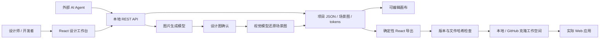

# Forma：设计与实现的统一工作空间

## 当前架构

Forma 是本地优先的可运行原型：React 编辑器 + Express 本地 API + 项目 JSON 数据库 + 可配置的模型服务 + 受保护的代码生成器。最大的业务单元是项目；项目拥有主题 tokens、页面、组件、图片生成记录、工作空间绑定及版本号。模板提供主题起点，项目自身保存 tokens 的副本。

全局导航只管理项目、主题模板和模型设置。打开项目后展开其概览、组件库、Design Tokens、代码同步及 Agent 接入入口；画布属于项目中的某个页面。页面切换不改变项目设计系统。侧边聊天贯穿项目概览、设计系统和画布，项目上下文随导航切换，会话历史按项目隔离；全局创建项目会话保留创建结果的入口。



`packages/schema/src/design.ts` 是编辑器的数据契约；服务端在 `apps/api/src/validate.ts` 验证同一契约。节点与组件通过稳定 ID 引用，节点可以绑定类型匹配的主题 token 与集合变量。页面坐标始终是绝对坐标；`parentId` 表达图层归属，编辑器和导出渲染器都按扁平数组顺序绘制，并继承祖先的隐藏、透明度、旋转和翻转。组件内节点使用组件画布坐标；`type: component` 实例运行时引用主组件，因此主组件变化会传播到这些实例。组件和父子图层的循环引用会被拒绝。

设计画布通过 `@forma/renderer/canvas` 使用 Canvas 2D 场景层与交互覆盖层；场景编译、空间索引、可见区域裁剪和有上限的位图缓存位于 `packages/renderer/src/canvas/`。项目预览、原型与导出 React 使用 `SceneRenderer.tsx`，两种渲染后端共享 `scene-values.ts` 的主题、变量和形状参数解析。导出器组合 DOM 渲染源码与共享解析源码，生成独立 React 代码。拖拽只更新编辑器内部预览，结束后再保存并记录一次历史；左侧图层列表使用可见行虚拟化。自动布局和尺寸约束由编辑器计算并保存为节点坐标；导出代码呈现这些坐标，不自动生成响应式应用布局。主题模式、变量集合、评论和手动版本快照均可持久化。详细能力与限制见 [画布能力清单](./CANVAS-CAPABILITIES.md)。

## 图片优先的生成流程

1. 保存项目主题和现有组件；图片提示词自动附加这些设计约束与页面信息。
2. 调用配置服务的 `POST /images/generations`，将图片保存在 `.data/assets/`，记录 `approved: false`。
3. 用户确认图片后，服务端记录批准状态，并校验生成时的设计上下文指纹。主题、主组件或页面规格变更会清除批准状态，要求重新生成图片。普通项目保存不能伪造图片或批准状态。
4. 将已批准的真实图片以 base64 提交给支持视觉输入的 `POST /chat/completions`，请求结构化的页面和节点。
5. 校验节点类型、ID、尺寸、token 引用、父子关系与组件循环，保存可编辑场景图。还原只使用已确认的图片需求；想改变需求必须重新生成并确认图片。
6. 在画布中继续编辑或导出。生成期间如果项目已被其他会话修改，服务端拒绝应用过时结果。

未配置模型或模型返回失败时，界面显示实际错误。系统不会将示例数据伪装成模型结果。服务须支持 OpenAI-compatible Images API、带 `image_url` 的 Chat Completions 与 JSON 输出。图片生成默认请求 `1536x1024`；不支持该尺寸或接口的模型需要换成兼容模型。此集成参考 [Images API](https://platform.openai.com/docs/api-reference/images) 和 [Chat Completions](https://platform.openai.com/docs/api-reference/chat)。

项目 tokens 与组件目录为跨页面一致性提供约束；目前没有训练专属模型或实现多次生成间的像素级一致性保证。视觉模型还原也需要设计师校对，不能保证自动精确复刻所有细节。

## 设计与代码同步

设计场景图是生成层的唯一来源。导出固定的 `forma-generated/` 目录：

| 文件            | 作用                                                                      |
| --------------- | ------------------------------------------------------------------------- |
| `design.json`   | 页面、组件、tokens 与设计版本                                             |
| `tokens.css`    | 项目主题 CSS 变量                                                         |
| `index.tsx`     | React `FormaPage` / `FormaComponent` 渲染器与 `onAction(nodeId)` 事件接口 |
| `manifest.json` | 项目归属、版本、生成文件 SHA-256                                          |
| `README.md`     | 使用方式与集成边界                                                        |

业务应用只需导入稳定组件，在生成目录外处理路由、数据、状态与业务事件：

```tsx
import { FormaPage } from './forma-generated';

export function Dashboard() {
  return <FormaPage pageId="page-dashboard" onAction={nodeId => {
    if (nodeId === 'create-project') openCreateProjectDialog();
  }} />;
}
```

消费方需要 React、TypeScript 与 `resolveJsonModule` 配置。导出包含画布的固定尺寸和定位，不会自动推导响应式布局、后端数据或业务逻辑。设计修改会更新生成目录；消费方开发服务器可通过文件监听更新页面。生产应用仍需要自己的构建、测试和部署步骤。

页面和主组件内的本地 PNG、JPEG、WebP 与安全 SVG 图片会在导出时嵌入 `design.json` 为 base64 data URL，因此消费应用不需要连接 Forma API。SVG 仅接受基本图形、分组、渐变和裁剪定义，拒绝脚本、事件、内联样式及外部资源引用。缺失、格式不匹配、超过资源限制或使用符号链接的本地图片会阻止导出，并返回具体错误。HTTP(S) 外部图片仍保留原地址，消费应用需要能访问对应地址；使用内嵌图片的应用 CSP 需要允许 `img-src data:`。

`FormaPage` 内置已保存的点击/悬停原型交互：页面跳转、浮层、返回和 HTTP(S) 外部链接，以及即时、淡入和滑动过渡。`onAction(nodeId)` 可将节点动作接入业务逻辑。`mode` 与 `variableModes` 参数可切换已保存的主题和变量模式；导出 JSON 保留所有模式。复杂业务状态、条件原型和完整生产路由并非原型渲染器的职责。

首次同步必须手动执行。之后项目可开启自动同步：每次保存成功后，服务端检查已建立的 manifest 和文件哈希，再写入受管理文件。外部修改会变成 `conflict`；所有写入在发现冲突时停止，项目本身仍被保存并返回 `syncWarning`。应先审查并将业务修改移出生成目录，再恢复到上次生成版本或通过新的目录接收设计更新。系统没有覆盖冲突文件的“强制同步”按钮。

服务端串行化项目写入与同步。PUT 使用 revision 比较防止不同浏览器或 agent 覆盖彼此的最新设计；同步应用可携带预览 revision 拒绝过时预览。同步会在写入前及每个文件替换前重新比较基线哈希，临时文件会在失败时清理，manifest 最后写入。这不是跨多个文件的数据库事务；异常断电或中途外部写入导致停止时，可能需要审查部分已更新文件。应用之外的进程在最终检查与替换之间仍存在很小的操作系统竞争窗口。

## 工作空间和本地安全边界

- 本地绑定只接受已经存在的绝对目录，生成器只写其下 `forma-generated/`。导出目录和目标文件不允许符号链接。
- GitHub 绑定使用 Git 将 HTTPS 仓库真实克隆到 `.data/workspaces/<projectId>/`。可选择分支；新目录必须不存在。公开仓库直接可用，私有仓库依赖本机 Git 已配置的凭据，系统没有 GitHub OAuth UI。
- 不自动提交、推送、合并或部署；这些动作由应用现有开发流程负责。解绑、删除项目不会递归删除绑定目录或克隆仓库。
- API 默认仅监听 `127.0.0.1:4310`；限制 Host、浏览器 Origin 和写请求 Content-Type。可通过 `FORMA_AGENT_TOKEN` 为无浏览器来源的本地 agent 请求启用 Bearer Token。
- 这不是多租户安全边界。具有本机进程访问权的程序应视为可信；不要将该服务直接暴露到公网。
- API Key 只由服务端使用，GET 设置不会返回密钥。通过设置页保存的密钥位于忽略提交的 `.data/settings.json`；它是本机文件而非操作系统密钥保险箱。也可只使用 `.env` 的 `OPENAI_API_KEY`。

## 文件布局

```text
apps/web/
  src/                    工作台页面、编辑器交互和应用状态
  public/                 品牌素材、图片与视频
  tooling/                Vite 开发预览支持
  vite.config.ts          前端构建、API 代理与共享包解析
apps/api/
  src/index.ts           HTTP 路由与本地访问限制
  src/config.ts          根目录环境变量、数据目录与 Web 产物路径
  src/store.ts           JSON 持久化及串行事务
  src/validate.ts        场景图、Token 与批准门槛校验
  src/provider.ts        图片、视觉还原与主题生成
  src/exporter.ts        React 导出、路径边界与冲突保护
  src/agent.ts           会话、模型计划与操作执行
  src/sync.ts            普通编辑与聊天共用的同步协调
  src/workspaces.ts      本地绑定与 GitHub 克隆
  tests/                  API、Agent 与运行路径测试
packages/
  schema/                 设计和 Agent 类型；Node 类型源码入口
  renderer/               共享场景渲染器；Node 独立导出源码入口
  editor-core/            几何、布尔与视口算法及相应测试
  ui/                     Radix 基础组件、Tailwind 样式与工具
  typescript-config/      基础配置及 React 配置
```

包依赖为：Web → UI / editor-core / renderer / schema；API → renderer；renderer 和 editor-core → schema。共享包不得反向依赖应用，跨包引用必须使用公开的包名与子路径，不能穿透 `src` 目录。

内部包是私有源码包：前端通过 Vite 消费 TypeScript/TSX，服务端仅加载 `@forma/renderer/source` 的 Node 入口。该入口在包内部组合渲染器与设计类型，使导出的 React 代码不依赖工作区包，也不读取 Web 应用源码。

API 的源文件与共享 Node 入口统一为 TypeScript。Node.js 22.18+ 直接执行 `.ts`；`@forma/typescript-config/node.json` 使用 strict、NodeNext、verbatimModuleSyntax 与 erasableSyntaxOnly 检查运行兼容性。项目存储、Agent 会话、审批记录、导出清单和同步结果均有显式类型，业务方法复用 `@forma/schema` 的公共契约。

pnpm 负责并行开发和递归检查。根目录保存唯一锁文件，catalog 固定迁移前的外部依赖版本，`workspace:*` 保证内部包使用本地实现。所有包复用 `@forma/typescript-config`；React 共享包通过 peerDependencies 声明 React 运行时，应用负责提供版本。

服务端不依赖启动目录：`.env`、默认 `.data/`、相对 `FORMA_DATA_DIR` 以仓库根目录解析，静态界面来自 `apps/web/dist/`。开发端的品牌资源 URL 保持 `/brand/...`，设计预览仍由 `/docs/...` 访问。

## 后续扩展边界

当前没有 Figma 文件格式导入、Figma 插件实时回传、多人协同 CRDT、完整矢量编辑、完整约束与响应式布局求解、设计分支合并、团队权限、审计日志或真正的商业模板交易市场。项目与内置模板、tokens、基础组件、画布和可配置生成链路提供了可扩展起点。

如果要让外部 Figma 的修改自动进入真实应用，建议添加 Figma 适配器：订阅或轮询指定文件版本，将 Figma 节点 ID 映射为本项目稳定 ID，先产生可审核的场景图差异，再复用现有同步与冲突检查。不要直接把外部 Figma 数据覆盖到用户业务源码。下一步也可以把导出器替换为面向实际组件库的 AST 生成器，保留相同的场景图、token 与 manifest 契约。
