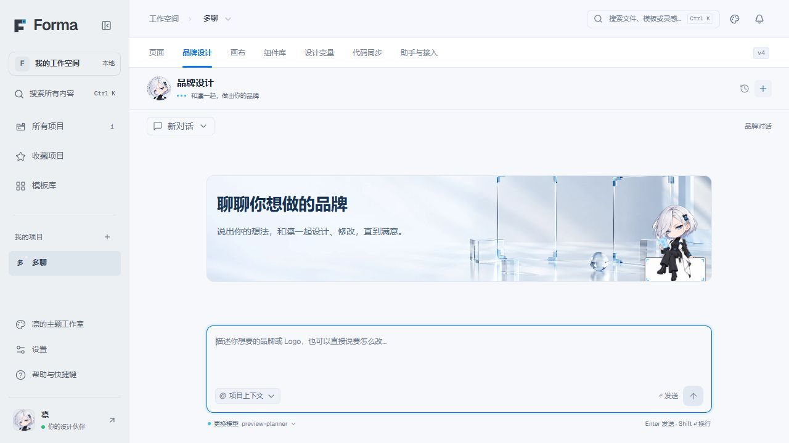

# 项目品牌设计聊天

入口：项目导航「品牌设计」或概览页「品牌 Logo」，地址 `#/project/:projectId/brand`。

用户直接聊天，AI 根据需求完成品牌与 Logo 设计，继续通过反馈修改。页面只有对话、作品和输入框，不要求填写品牌简报、挑选固定数量的方案或通过四个阶段。

截图为隔离测试环境中的页面。

## 指南作为前置提示词

每一轮品牌聊天都从 [AI Logo 与品牌视觉设计指南](brand/ai-logo-brand-design-guide.md) 读取全文，注入模型的 system 消息。生成与矢量整理也使用该指南，修改文档即可影响后续请求。指南读取失败会明确报错。

指南中的信息清单、探索和检查是 AI 的内部工作方法。已有项目介绍、对话需求和认可的特征直接沿用；可以合理推断的视觉选择先设计，只有影响方向且无法推断的关键缺口才追问。不要把「不用放大镜」理解为「去掉搜索含义」，也不要用解释给装饰圆圈附会意义。

## 对话中的使用

例如，用户输入「多聊是群聊与搜索结合的平台，帮我做一个黑白高级感的 Logo」，AI 可直接生成作品。用户继续说「保留这个气质，去掉旁边意义不明的圆圈」，AI 带着原图修改并保存新版本。用户说「给我 SVG」，AI 整理矢量稿供查看与下载。这些请求彼此没有固定顺序，也可以只聊构思、比较方案或提出其他品牌视觉需求。

图片可直接下载。矢量稿可下载 SVG、透明 PNG，以及包含原色 SVG、单色反白 SVG、JSON 源数据和设计要求的 ZIP。生成图、矢量稿和采纳是独立行为；只有用户明确说「用这版作为项目 Logo」时才替换项目标识。

## 实现边界

- 复用现有 AI 聊天、模型切换、错误恢复和服务端历史记录；品牌会话使用 `mode: brand`，与页面设计会话分开。
- 品牌模式仅允许生成品牌图片、整理矢量和采用项目标志，不写页面、主题或代码同步状态。
- 作品保存在 `Project.brandDesign.artifacts`，修改保留 `parentId`，对话动作通过 `brandArtifactId` 关联作品。普通项目保存保留品牌状态。
- 同一项目的生成冲突或项目修订变化会拒绝过期写入；失败不覆盖已有作品。
- 原表单流程的数据兼容迁移，原始简报和方向保存在 `legacy`，历史作品和已经采用的标志继续保留。
- 矢量转换返回受校验的路径数据；字体排版、模型视觉还原精度及真实品牌识别效果仍需按具体作品判断。

## 验证

针对性自动测试覆盖全文提示词注入、自然语言直出图片、原图修改、无审批矢量下载、对话模式隔离、历史持久化、失败与并发保护和旧数据迁移。界面验证使用隔离的模拟模型与多聊图片夹具，不代表真实模型的设计质量评测。
