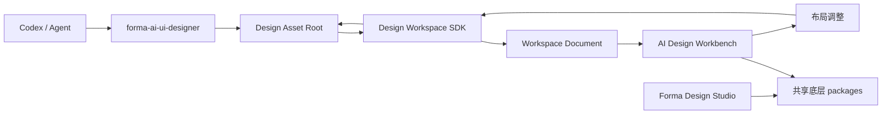

# AI Design Workbench 架构

状态：已确认的实现基线  
范围：本地单项目工作台、Design Workspace SDK、`forma-ai-ui-designer` Skill Plugin  
不影响：现有 Forma Design Studio 产品及其多项目能力

## 1. 背景与目标

`ai-ui-designer` 当前把 `DESIGN.md`、Design Tokens、组件规范、流程 JSON、页面图片和标注组织成静态 `review.html`。新的目标是保留其设计工作流，但由一个独立的本地工作台承载流程浏览：页面图片作为画布中的原生 Image Node，转场、标注、组件引用和 Tokens 由工作台分别呈现。

本方案包含三个独立交付物：

1. `forma-ai-ui-designer`：指导 Agent 产生符合契约的设计资产。
2. `@forma/design-workspace-sdk`：读取、校验、转换和安全写回设计资产。
3. `@forma/ai-design-workbench`：通过 `npx` 启动的单项目本地工作台。

CLI 是仓库中唯一需要公开发行的新包，因此作为 `private: true` 仓库包约定的明确例外。SDK、Schema 和 Skill Plugin 在发行时被打包进 CLI，不依赖用户的 workspace。

## 2. 产品边界

### 2.1 现有 Forma Design Studio

现有 `apps/web` 和 `apps/api` 继续作为完整设计与代码工作空间，保留项目管理、模板、场景编辑、模型生成、代码同步和 Agent 会话。新工作台不得通过删除或隐藏现有功能来实现。

### 2.2 AI Design Workbench

AI Design Workbench 是单独的产品入口，只服务一个设计资产根目录。它包含：

- 流程切换、页面搜索和项目概况；
- 无限画布、缩放、拖动和适应画布；
- 页面、弹层、状态图的 Image Node；
- 由真实 transition 生成的正交连接线；
- 独立标注层和按需展开的气泡；
- 系统级 Design Tokens 与设计组件规范；
- 页面、连接线和组件引用检查器；
- 原图查看、布局保存和 revision 变化自动刷新；
- Markdown 组件规范与流程设计依据的查看/编辑，以及注释编辑；内容经 ChangeSet 写回源文件，保留草稿并检测并发冲突。

它不包含：

- 多项目列表、项目创建或项目切换；
- 模板库或模板市场；
- 完整矢量/结构化 UI 编辑器；
- 图片到 UI 图层的视觉还原；
- 代码同步、GitHub 绑定或部署；
- 现有 Forma 的全局导航和项目数据库。

## 3. 总体结构



`design/` 是唯一设计事实源。`WorkspaceDocument` 是 SDK 每次读取后产生的运行时投影，不是第二份持久化数据库。

## 4. 模块与 seam

| Module | Interface | 隐藏的 Implementation |
| --- | --- | --- |
| Skill Plugin | `SKILL.md` 及其 references | 业务理解、出图、组件检索、流程维护和交付规则 |
| Design Workspace SDK | `openDesignWorkspace()` 返回的工作区对象 | JSON/Markdown 读取、图片测量、引用校验、布局加载、revision 与原子写入 |
| Workbench CLI | `init / open / validate / skill` 命令 | Skill 检测安装、本地服务器、端口选择、浏览器启动和进程生命周期 |
| Workspace Renderer | `WorkspaceDocument` | Image Node、连线、标注、检查器和大图查看器 |
| Shared Canvas Core | 视口与几何函数 | 平移、缩放、适应画布、正交路径和命中测试 |

外部 seam 只放在设计资产目录与 SDK 之间。文件解析、兼容导入、布局和写入事务是 SDK 内部 seam，不暴露给 Skill 或工作台调用方。

## 5. SDK Interface

SDK 保持一个较小的 Interface：

```ts
export interface DesignWorkspace {
  read(): Promise<WorkspaceDocument>;
  validate(): Promise<ValidationReport>;
  apply(changeSet: WorkspaceChangeSet): Promise<ApplyResult>;
  watch(listener: (event: WorkspaceEvent) => void): Promise<Disposable>;
  resolveAsset(relativePath: string): Promise<string>;
}

export function openDesignWorkspace(options: {
  root: string;
}): Promise<DesignWorkspace>;
```

调用方不需要知道索引加载顺序、图片尺寸读取方式、文件锁、临时文件或 v1 兼容细节。测试也只通过这个 Interface 观察结果。

`read()` 不修改资产；`validate()` 返回结构化问题；`apply()` 必须携带读取时的 `baseRevision`，避免工作台和 Agent 相互覆盖；`watch()` 只通知已完成的稳定 revision，不暴露写入中的临时状态。

## 6. Image Node 模型

每个页面、modal、drawer 或 state 在流程画布中表示为一个 Frame Node，其中包含一个 Image Node：

```text
FlowPageFrame
├── ImageNode
├── AnnotationLayer
└── ReviewBadge
```

Image Node 使用图片的实测像素，不进行 OCR、DOM 重建或结构化图层还原：

- `width` 和 `height` 等于实测尺寸；
- 保持原始纵横比，不裁切；
- 相机缩放不修改资源；
- 图片默认锁定，页面 Frame 可以在流程画布中移动；
- 标注、状态和连接线始终是独立节点；
- 更换图片版本时保持 page ID，更新 asset revision。

这使“转换”严格表示为设计资源到设计流程的转换，而不是位图到可编辑 UI 的推断。

## 7. 系统级 Tokens 与组件

系统级表示在当前设计资产根目录内全局唯一，而不是跨项目云端全局：

- `tokens.json` 定义所有流程共享的语义 Tokens；
- `components/index.json` 定义版本化设计组件规范；
- 页面通过 `component_usage` 引用组件的确切版本；
- Tokens 或组件升级后，SDK 计算受影响页面并在工作台展示版本差异；
- Tokens 与组件不直接改写已生成图片像素，它们约束下一次生成和一致性审查。

设计组件继续是 Markdown 设计规范，不等同于 React/Vue 代码组件。

## 8. Skill Plugin 管理

Skill 的唯一源码放在仓库内独立 Plugin 包：

```text
packages/forma-ai-ui-designer/
  package.json
  .codex-plugin/plugin.json
  skills/forma-ai-ui-designer/
    SKILL.md
    agents/openai.yaml
    references/
    scripts/
    assets/
```

使用 `forma-ai-ui-designer` 作为稳定技能 ID，显示名仍可为 `AI UI Designer`。它与旧的 `ai-ui-designer` 并存，避免把仍要求 `review.html` 的旧技能误判为兼容版本。

`init` 先检测兼容版本，再决定是否询问：

1. 项目级 `.agents/skills/forma-ai-ui-designer`；
2. 全局 `$CODEX_HOME/skills/forma-ai-ui-designer`；
3. 未找到兼容版本时，询问“项目级（推荐）/全局/跳过”；
4. 已安装兼容版本时直接复用；
5. 旧版本询问升级位置；新版本不自动降级；
6. 非托管同名目录不得覆盖或删除。

项目只声明所需版本；实际安装目录通过 `.forma-skill.json` 管理标记记录版本与校验和。默认采用复制、校验和与备份替换，不使用软链接。

## 9. 本地运行

```bash
npx @forma/ai-design-workbench init
npx @forma/ai-design-workbench open ./design
```

发行版使用单个 Node 进程提供构建后的工作台和本地读写接口，监听 `127.0.0.1`。浏览器与接口同源，不依赖 Vite 的开发端口，也不要求用户维护 Origin 白名单。

`open` 的启动顺序：

1. 解析 `forma.config.json` 与设计根目录；
2. 获取只读快照并完成校验；
3. 启动同源本地服务器；
4. 打开浏览器并加载 `WorkspaceDocument`；
5. 监听 revision 变化并原子刷新。

## 10. 写入与冲突

- 所有持久化写入必须经过 SDK；
- 写入前比较 `baseRevision`；
- 使用项目内锁文件防止跨进程同时提交；
- 先写临时文件，校验后再原子替换；
- 画布位置写入独立 `layout.json`，不污染业务流程关系；
- 工作台不得根据视觉排列虚构 transition；
- 旧资产中的 review 元数据被忽略；页面不设置评审流程；
- 写入冲突返回结构化差异，不提供静默覆盖。

## 11. 已确认的架构决策

1. 新建独立 AI Design Workbench，不最小化现有 Forma。
2. 页面图片直接作为 Image Node，不要求双重表示。
3. `design/` 是唯一事实源，运行时文档是投影。
4. Skill 源码以独立 Plugin 包随仓库维护。
5. 项目级 Skill 安装为默认推荐，全局安装为可选项。
6. Skill 兼容性由稳定 ID、版本和校验和共同判断。
7. `review.html` 降级为可选离线导出，不属于默认完成口径。
8. 云端模板市场不进入首期 Module；未来只需生产相同的设计资产契约。

### 缩放渲染

最小工作台按相机位置与缩放值计算页面的屏幕坐标和尺寸，直接显示原图，不缩放缓存的整个 DOM 图层。SVG 连接线、页面标题和业务标注独立按屏幕坐标绘制；流程标签、标题、箭头、连线和业务标注的尺寸随同一缩放比例计算；侧栏、标尺和浮动工具栏保持固定屏幕尺寸。滚轮以指针为锚点，缩放按钮以视口中心为锚点，范围为 5%–400%，百分比按钮恢复 100%。位图内容仍受原始分辨率限制，任意放大无损需要矢量或结构化设计节点。
