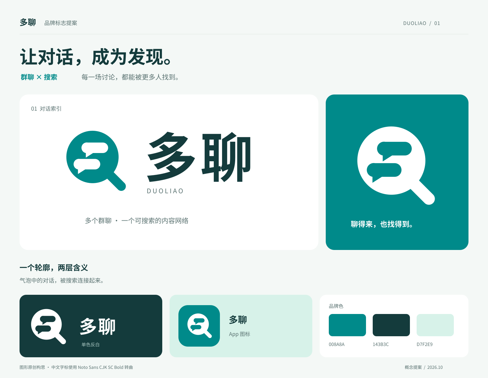
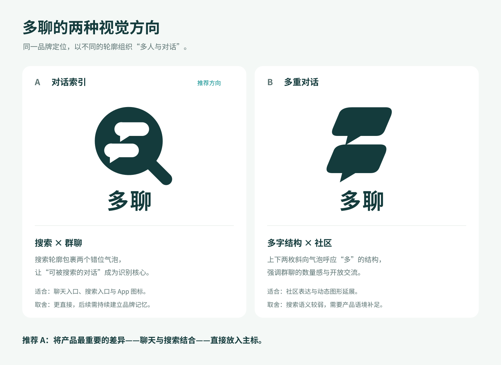
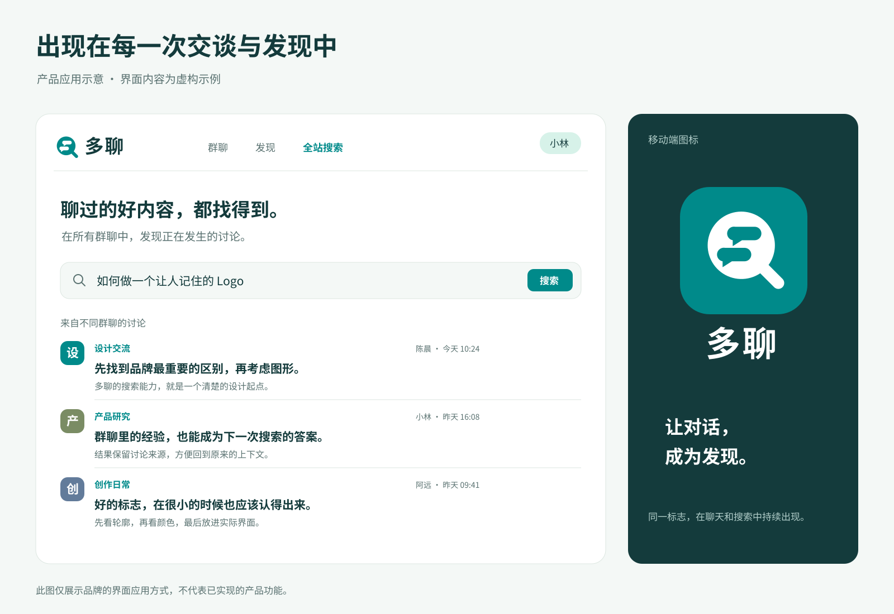
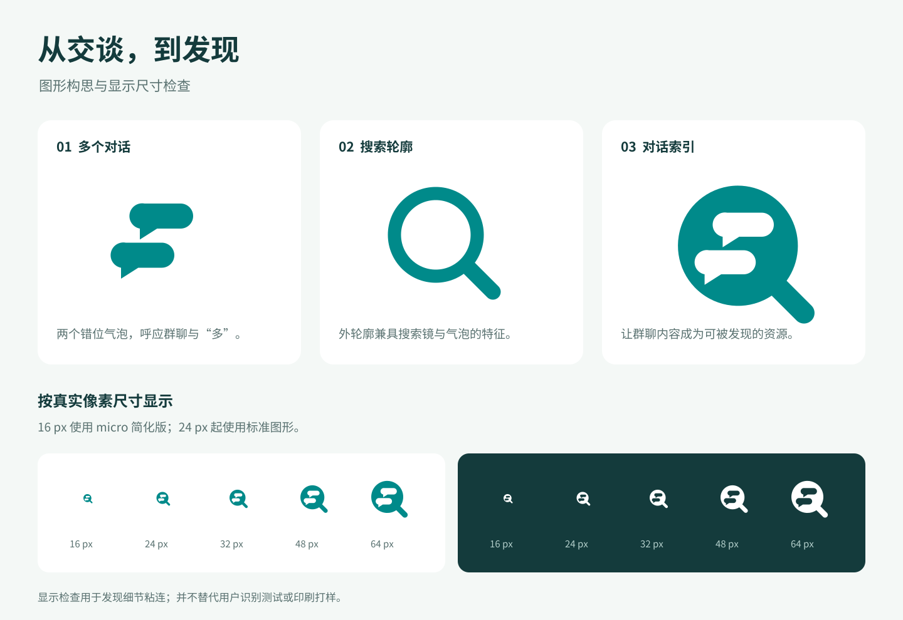

# 多聊 Logo 设计提案

多聊将群聊与搜索结合：各群的聊天内容成为可检索资源，平台的群聊用户可以查看不同群中的讨论。推荐方案以“对话索引”为核心，用搜索轮廓与两个对话气泡共同表达这个特点。

本次按用户选择的“清爽可信，适合长期使用的聊天工具”方向设计。正式品牌名为“多聊”；展示中的 DUOLIAO 为辅助拼音。宣传语“让对话，成为发现。”是本次提出的品牌文案。

## 推荐方案

标志外部为圆形主体与斜向尾部，能够联想到搜索镜，也具有对话气泡的特征。内部用两个透明的气泡作为负形，上下错位呼应多个群聊，以及“多”的上下结构。整个图形可使用单色呈现。

选择这一方向，是因为“对话可以被搜索”是多聊区别于普通聊天工具的核心描述。字标采用稳定的粗体中文，配合圆润图形，在亲近感与长期使用的工具感之间取得平衡。图形的记忆点是错位的双气泡，而非额外的装饰元素。

## 方案比较

| 方向 | 主要表达 | 取舍 |
| --- | --- | --- |
| A 对话索引 | 将多群对话组织进搜索轮廓 | 产品差异更直接，推荐作为主标 |
| B 多重对话 | 两个斜向气泡呼应“多”的上下结构 | 更强调社区交流，搜索含义需要产品语境补足 |

二者使用相同的单色背景和中文字标对照。B 保留为备选探索，不与主方案混用。

## 品牌颜色与文字

| 角色 | 色值 | 主要用途 |
| --- | --- | --- |
| 多聊青 | `#008A8A` | 主标、App 图标、品牌强调 |
| 深墨青 | `#143B3C` | 中文字标、标题、深色展示背景 |
| 浅薄荷 | `#D7F2E9` | 辅助背景和轻量装饰 |
| 雾白 | `#F4F8F6` | 展示底色 |
| 白 | `#FFFFFF` | 反白图形与浅底展示 |

中文标志字采用 Noto Sans CJK SC Bold，展示说明采用同系列 Regular。交付 SVG 中的文字已经转为路径，不依赖接收方安装字体；可以编辑路径，但不属于可直接键入替换的活文字。字体是现成字族，本次没有将其标为独立设计的定制字体。

字体来源为 [Noto CJK 官方仓库](https://github.com/notofonts/noto-cjk/tree/main/Sans/OTF/SimplifiedChinese)，使用的[字体许可证](https://raw.githubusercontent.com/notofonts/noto-cjk/main/Sans/LICENSE)副本保存在 [FONT-LICENSE.txt](./FONT-LICENSE.txt)。本目录未包含完整字体文件。

## 使用规则

- 标准图形用于 24 px 及以上的数字显示；16 px 网站图标使用 micro 版本。16 px 下主要保留总体轮廓与双气泡节奏，气泡尾部的细节识别有限。
- 中文横版优先用于网站导航、产品入口和介绍材料。空间不足时使用独立图形，避免把整套图文组合缩到无法阅读。
- 深色背景使用反白版本。复杂背景上增加干净的承载区域，保持内部负形清楚。
- 初始留白建议为标志画布边长的 15%，从实际图形边界向外计量。组合版的图文间距已经包含在 SVG 中，外围仍应保留留白。
- 等比例缩放；保留两个气泡的位置、大小关系和斜向尾部。不要填实内部透明区域、随意添加描边或拉长搜索尾部。
- App 图标提供圆角展示版与无预裁圆角的方形源文件。使用平台图标遮罩时，以方形版本继续适配。
- 宣传语和辅助拼音可以用于品牌介绍，不是图形标志的必要组成部分。

## 产品应用示意

示意图展示主标在导航区、搜索入口和移动端图标中的应用。搜索结果通过不同群名表达跨群发现内容的场景。图中的群名、人物、讨论、时间和界面均为虚构示例，不代表已有用户数据或已实现的功能。

## 图形与尺寸检查

已渲染并查看主展示板、两个概念对照、产品应用图，以及 16、24、32、48、64 px 的浅底和深底显示。标准版在 24 px 及以上能够分清两个气泡；16 px 使用间隙调整版本，并限制为辅助网站图标。

交付 SVG 使用真实路径，不包含嵌入位图、外部图片或 foreignObject。标准图形内部使用透明负形；反白资产保留透明背景。显示检查针对本次数字预览，不替代用户识别测试或印刷打样。未开展商标近似检索。

## 文件清单

| 文件 | 用途 |
| --- | --- |
| [logo-symbol.svg](./logo-symbol.svg) | 标准蓝绿色图形，100 × 100 画布 |
| [logo-symbol-mono.svg](./logo-symbol-mono.svg) | 纯黑单色图形 |
| [logo-symbol-reverse.svg](./logo-symbol-reverse.svg) | 白色图形，透明背景 |
| [logo-symbol-micro.svg](./logo-symbol-micro.svg) | 16 px 显示用的细节调整版本 |
| [logo-horizontal.svg](./logo-horizontal.svg) | 中文横版组合，342 × 140 画布 |
| [logo-horizontal-reverse.svg](./logo-horizontal-reverse.svg) | 中文横版反白组合 |
| [logo-stacked.svg](./logo-stacked.svg) | 中文竖版组合 |
| [app-icon.svg](./app-icon.svg) | 圆角 App 图标展示版 |
| [app-icon-square.svg](./app-icon-square.svg) | 方形 App 图标源文件 |
| [favicon.svg](./favicon.svg) | 网站图标矢量版本 |
| [logo-symbol-1024.png](./logo-symbol-1024.png) | 1024 × 1024 透明背景图形 |
| [logo-horizontal.png](./logo-horizontal.png) | 1260 × 516 透明背景中文组合 |
| [app-icon-1024.png](./app-icon-1024.png) | 1024 × 1024 圆角图标 |
| [app-icon-square-1024.png](./app-icon-square-1024.png) | 1024 × 1024 方形图标 |
| [favicon-16.png](./favicon-16.png) 和 [favicon-32.png](./favicon-32.png) | 小尺寸网站图标 |
| [brand-board.svg](./brand-board.svg) 和 [brand-board.png](./brand-board.png) | 品牌主展示板 |
| [concept-directions.svg](./concept-directions.svg) 和 [concept-directions.png](./concept-directions.png) | 两个方向的对照 |
| [construction-and-sizes.svg](./construction-and-sizes.svg) 和 [construction-and-sizes.png](./construction-and-sizes.png) | 构思与小尺寸检查 |
| [application-preview.svg](./application-preview.svg) 和 [application-preview.png](./application-preview.png) | 产品应用示意 |
| [alternative-symbol.svg](./alternative-symbol.svg) | B 方向的备选图形 |
| [palette.json](./palette.json) | 品牌配色和命名记录 |

## 设计依据

方法遵循 [AI Logo 与品牌视觉设计指南](../ai-logo-brand-design-guide.md)：从产品差异提取语义，比较单色轮廓，再建立配色、字标和应用。视频参考用于学习负形与图形组合方法，未沿用其中案例的具体图形。

此次交付为多聊品牌 Logo 的第一版可编辑设计提案。文件保存在独立资料目录，未替换项目正在使用的品牌资产。
