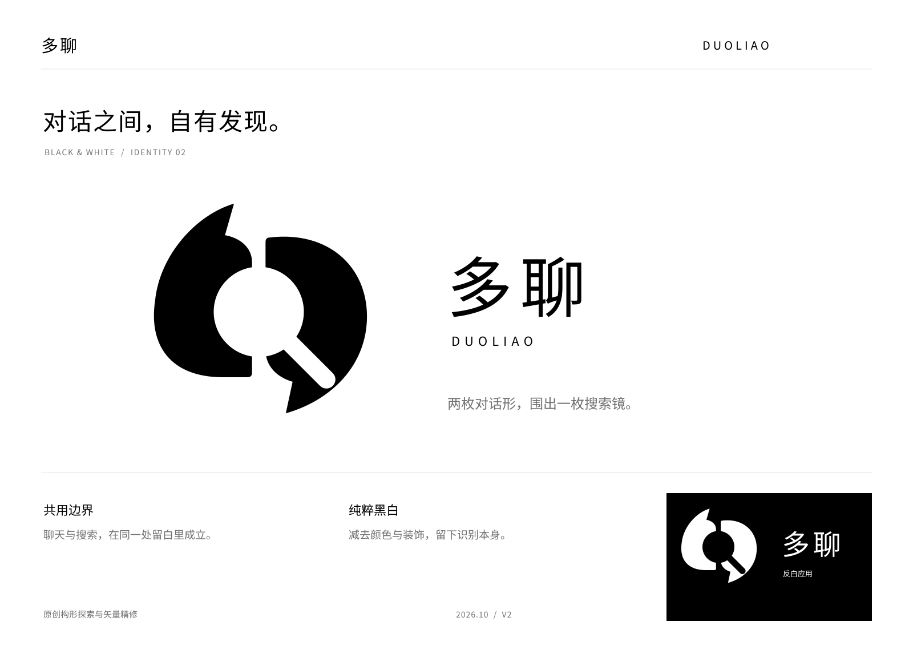
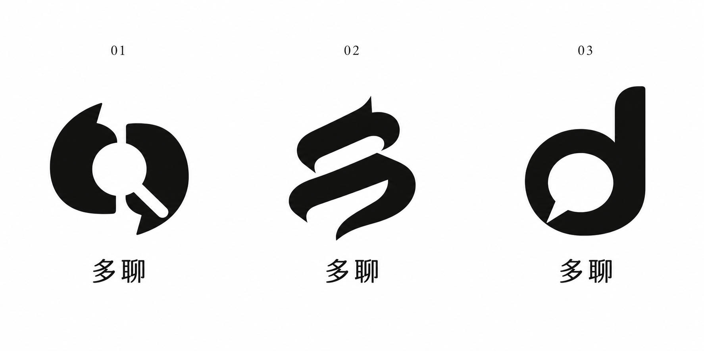
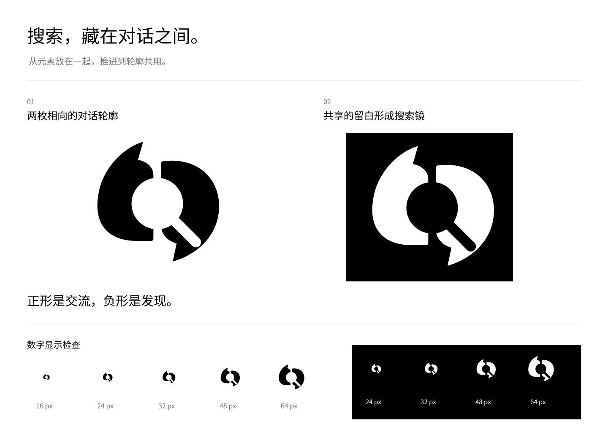
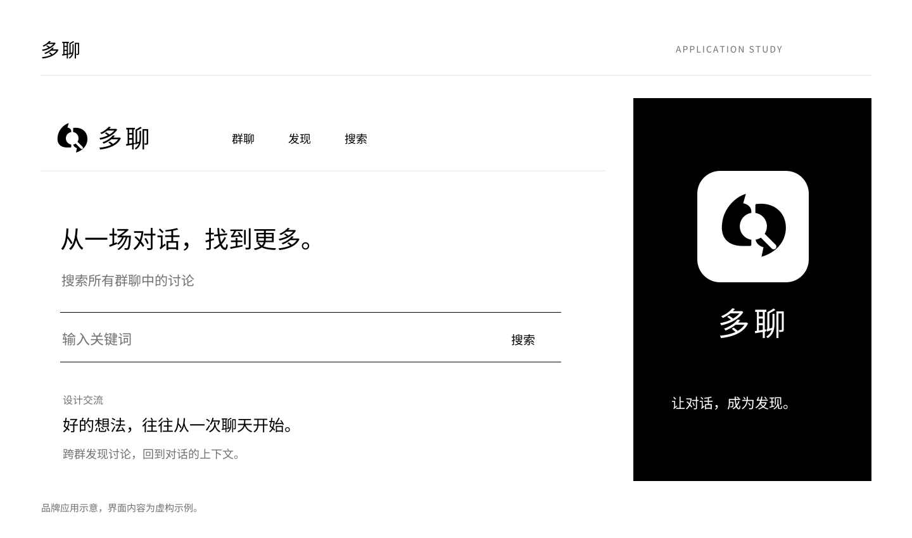

# 多聊黑白 Logo 设计提案

本版根据“黑白、高级感、接近参考视频中巧妙融合的构思”重做，推荐方向为“对话之间”。群聊与搜索仍是品牌语义，图形改用共用边界和负形表达；第一版留在相邻目录供对照。

## 图形构思

两枚相向的黑色轮廓借用引号与对话气泡的形态。它们之间的透明圆形与斜向开口共同构成搜索镜，聊天的内边界同时就是搜索的外边界。用户可先看到一枚紧凑的黑白符号，再发现内部的搜索形状。

“正形表达交流，负形表达发现”是本方案的设计意图，是否能让新用户独立读出这一层含义，仍需用户识别测试。与第一版相比，搜索镜不再作为容器承载两个小气泡，主要变化发生在图形结构。

保留较饱满的图形质量，配合减重的中文字标和较宽的字距。黑白、留白和图文比例共同形成克制的视觉方向。没有用渐变、金属、阴影或样机材质增加装饰。

## 本轮探索

| 方向 | 构思 | 取舍 |
| --- | --- | --- |
| 01 对话之间 | 两枚对话形共享搜索镜负形 | 最能回应产品的聊天与搜索结合，选作本轮精修方向 |
| 02 多字构形 | 两笔斜向形态呼应“多”的结构 | 轮廓更偏书写性，搜索语义较弱 |
| 03 字母对话 | 小写 d 的内部形成对话轮廓 | 简洁，但名称专属性和搜索含义较弱 |

探索图由内置 imagegen 生成，提示词保存在 [generation-prompt.txt](./generation-prompt.txt)。正式交付图形根据 01 的构思重新构建贝塞尔路径并进行几何减除，源文件包含真实矢量曲线。探索图是栅格图，正式 SVG 是另行重绘的矢量母版。

## 标准资产

- [黑色图形 SVG](./logo-symbol.svg)
- [白色图形 SVG](./logo-symbol-reverse.svg)
- [黑色中文横版 SVG](./logo-horizontal.svg)
- [白色中文横版 SVG](./logo-horizontal-reverse.svg)
- [中文竖版 SVG](./logo-stacked.svg)
- [圆角 App 图标 SVG](./app-icon.svg)
- [方形 App 图标 SVG](./app-icon-square.svg)
- [透明背景图形 PNG](./logo-symbol-1024.png)
- [透明背景横版 PNG](./logo-horizontal.png)
- [圆角 App 图标 PNG](./app-icon-1024.png)
- [方形 App 图标 PNG](./app-icon-square-1024.png)

图形仅使用纯黑 `#000000` 或纯白 `#FFFFFF`。内部搜索形状为透明负形，不是盖在图形上的白色贴片。展示说明中的灰色用于次要文字，不属于标志主色。

所有 SVG 均可编辑路径，不含嵌入位图。中文字标使用 Noto Sans CJK SC Regular，并已转为路径，不是自创字库或可直接输入替换的活文字。DUOLIAO 为辅助拼音；其展示不是正式英文商标命名。

字体来自 [Noto CJK 官方仓库](https://github.com/notofonts/noto-cjk/tree/main/Sans/OTF/SimplifiedChinese)，许可证副本见 [FONT-LICENSE.txt](./FONT-LICENSE.txt)，目录未包含完整字体文件。图形路径和字标参数另存于 [geometry.json](./geometry.json)。

## 使用与检查

已渲染查看 16、24、32、48、64 px 的图形，并检查浅底和深底版本。建议主标从 32 px 起使用，24 px 可用于辅助导航；16 px 时尖端、分隔间隙和搜索柄附近的细节损失明显，本版不将其作为推荐的完整识别尺寸。

保持两枚轮廓之间的间隙，按原比例缩放。深底使用反白版；不要填实负形、加粗描边、单独移动某个轮廓或给搜索镜填入另一种颜色。外围初始留白建议不小于图形画布边长的 15%，具体应用按实际尺寸检查。

本轮检查覆盖数字显示和文件结构，未进行用户识别测试、印刷打样或商标近似检索。

## 应用示意

应用图用于观察标志在聊天搜索平台中的比例与层级。界面与内容为虚构示例，不代表已实现的产品功能。本次未替换现有应用中的资产。

## 展示文件

- [品牌展示板 SVG](./brand-board.svg) 与 [PNG](./brand-board.png)
- [构思与尺寸检查 SVG](./concept-and-sizes.svg) 与 [PNG](./concept-and-sizes.png)
- [产品应用示意 SVG](./application-preview.svg) 与 [PNG](./application-preview.png)
- [设计方法指南](../ai-logo-brand-design-guide.md)

第一版保留于同级 duoliao-v1 目录，未纳入本次素材包。
