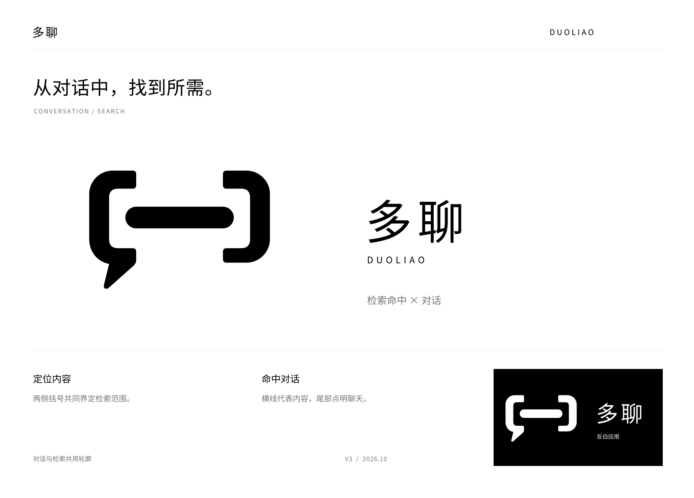
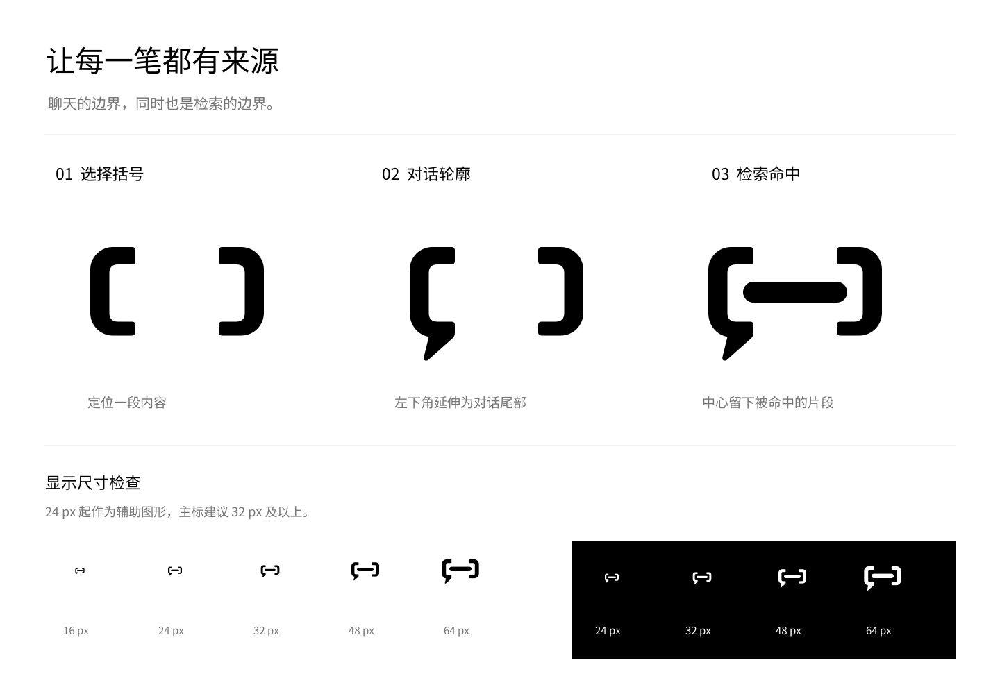
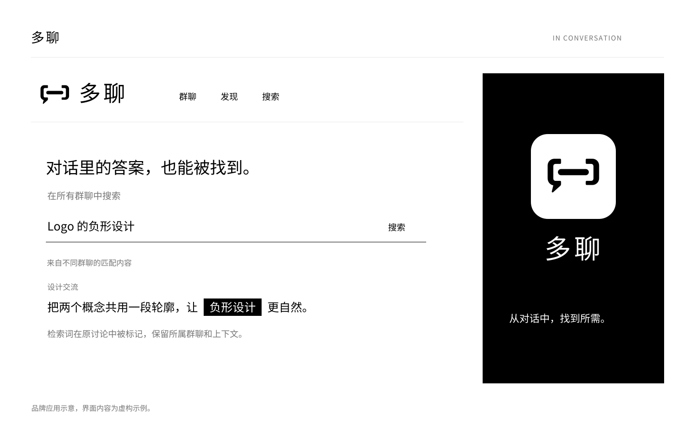

# 多聊 · 检索命中

当前设计提案：用「定位到一段对话」表达搜索，延续纯黑白、克制、清爽可信的视觉方向。品牌是一个群聊与搜索结合的平台：群聊中的讨论可以成为其他群聊用户可检索、可查看的内容资源。本稿尚未经过用户识别测试或最终定稿确认。

## 图形如何表达产品

两侧的选择括号用于表达定位内容；中间的横条用于表达被命中的文字片段；左侧括号的下端延伸成对话尾部。检索边界同时构成聊天的轮廓，把「聊天中找到内容」压缩为一个符号。主标不再使用放大镜，也没有独立的装饰圆圈。

这一路径借鉴了[AI Logo 与品牌视觉设计指南](../ai-logo-brand-design-guide.md)中「共形」与「结构替换」的方法。它着重表达搜索的结果与动作，而非搜索工具的外形。

括号与横条并不是通用的搜索图标。脱离品牌名称和产品语境，可能被读作输入框、代码括号或减号；是否能让新用户联想到搜索，仍需识别测试。书本、内容档案等探索方案对知识积累的表达更强，但搜索含义不够直接，因此未用作当前主标。

## 视觉与使用建议

- 标志只使用黑色 `#000000` 与白色 `#FFFFFF`。灰色仅用于提案说明文字和分隔线。
- 中文字标使用 Noto Sans CJK SC Regular，并已转成矢量路径；字距为字号的 0.12 倍。它是现有字体的排版组合，并非原创字体。
- 图形画布为 120 × 100，三部分均为独立可编辑路径，参数保存在 `geometry.json`。
- 主标建议以 32 px 及以上宽度显示；24 px 可作为辅助图形。16 px 下对话尾部与内部间隙的识别较弱，暂不作为推荐的正式图标尺寸。
- 四周至少保留约一根主笔画粗细的空白；避免压缩、拉伸、添加阴影或将细节改为描边。
- 反白 SVG 背景透明，适合放在黑底上。App 图标同时提供圆角预览和用于平台遮罩的完整方形底图。

## 应用示例

将「命中的片段」延伸为搜索结果中的黑底白字高亮，可帮助图形与产品行为建立联系。以下界面为品牌应用示意，内容为虚构示例，不代表已实现的产品功能。

## 交付文件

| 用途 | 文件 |
| --- | --- |
| 黑色与反白独立标志 | [logo-symbol.svg](logo-symbol.svg)、[logo-symbol-reverse.svg](logo-symbol-reverse.svg) |
| 中文横向组合 | [logo-horizontal.svg](logo-horizontal.svg)、[logo-horizontal-reverse.svg](logo-horizontal-reverse.svg) |
| 中文竖向组合 | [logo-stacked.svg](logo-stacked.svg) |
| App 图标 | [app-icon.svg](app-icon.svg)、[app-icon-square.svg](app-icon-square.svg) |
| 提案展示板 | [brand-board.svg](brand-board.svg)、[brand-board.png](brand-board.png) |
| 构思与尺寸检查 | [construction-and-sizes.svg](construction-and-sizes.svg)、[construction-and-sizes.png](construction-and-sizes.png) |
| 应用示例 | [application-preview.svg](application-preview.svg)、[application-preview.png](application-preview.png) |
| 透明 PNG | [logo-symbol-1200.png](logo-symbol-1200.png)、[logo-horizontal.png](logo-horizontal.png) |
| 1024 px App 图标 | [app-icon-1024.png](app-icon-1024.png)、[app-icon-square-1024.png](app-icon-square-1024.png) |

SVG 使用真实路径，不含嵌入位图或依赖本机字体的文字。PNG 为相应 SVG 的导出文件。v1、v2 保留在各自目录，本次未替换项目中正在使用的品牌资源。

## 生成方法与参考记录

概念探索使用内置 ImageGen 工具，随后重建几何路径、转曲文字并排版为原生 SVG。栅格探索图仅作创意参考，以本目录中的 SVG 为当前提案的形态依据。

| 阶段 | 参考图 | 完整提示词 |
| --- | --- | --- |
| 知识与对话的概念探索 | [concept-exploration.png](concept-exploration.png) | [generation-prompt.txt](generation-prompt.txt) |
| 搜索语义的方向比较 | [search-directions.png](search-directions.png) | [search-directions-prompt.txt](search-directions-prompt.txt) |
| 检索命中方向细化 | [selected-concept.png](selected-concept.png) | [selected-concept-prompt.txt](selected-concept-prompt.txt) |

方向比较图包含放大镜对照方案；最终主标不使用该元素。

字体来源：[Noto CJK 官方项目](https://github.com/notofonts/noto-cjk/tree/main/Sans/OTF/SimplifiedChinese)，许可副本见 [FONT-LICENSE.txt](FONT-LICENSE.txt)。

## 检查范围

已检查 SVG 结构、黑白与透明背景、导出尺寸，以及展示板和应用图的排版。小尺寸检查用于观察图形细节，不等于用户可用性验证。

本轮仅制作品牌设计素材，未运行 lint、typecheck 或 build；未使用 pnpm。未进行商标近似检索或真实用户识别测试。
